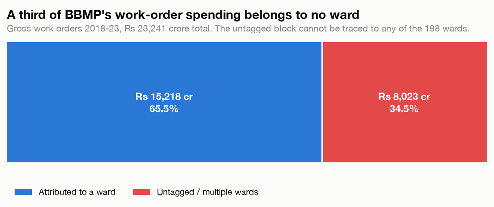
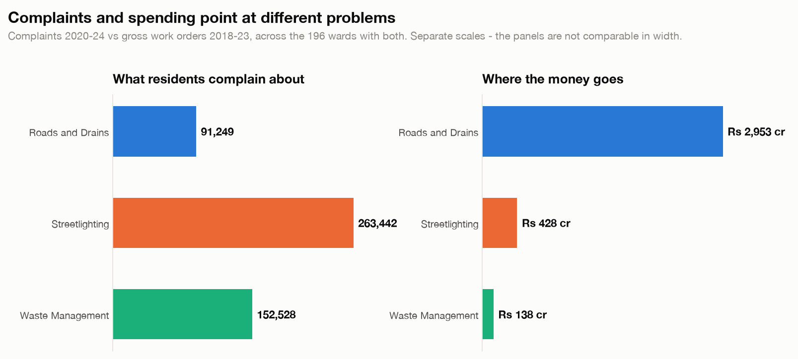
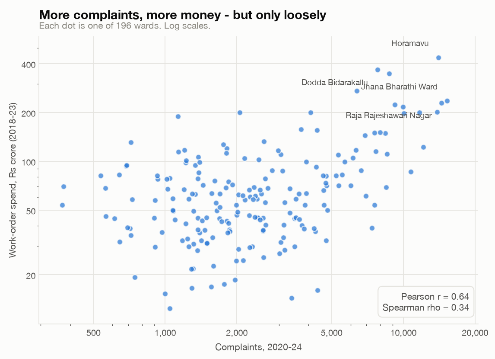
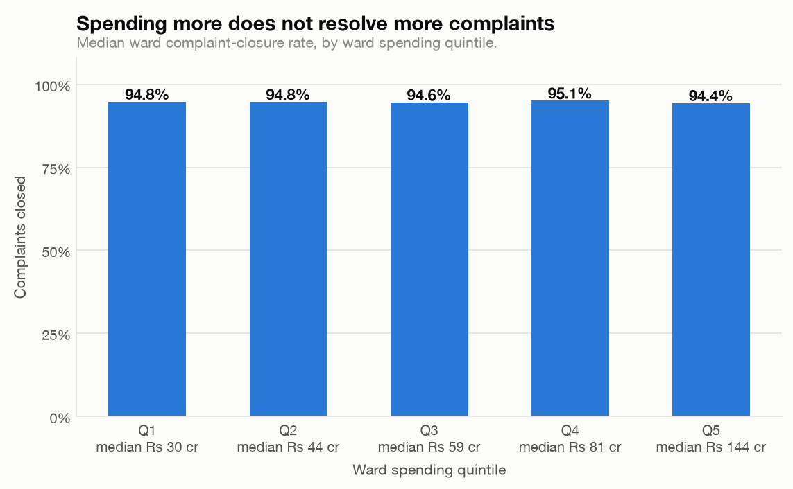
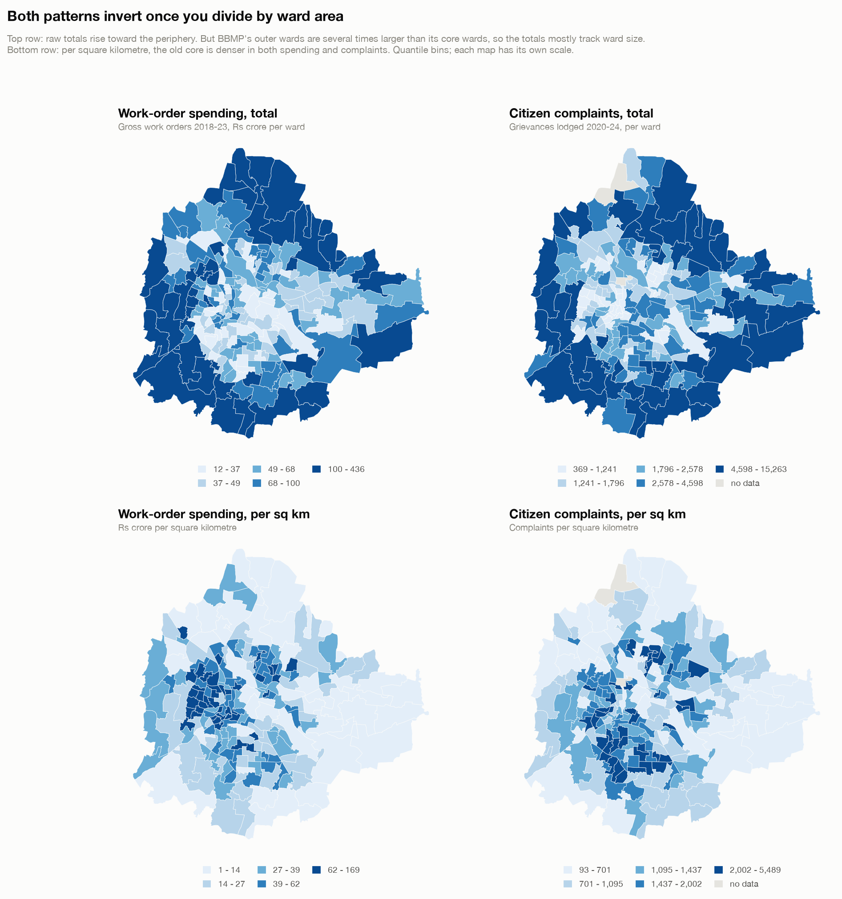
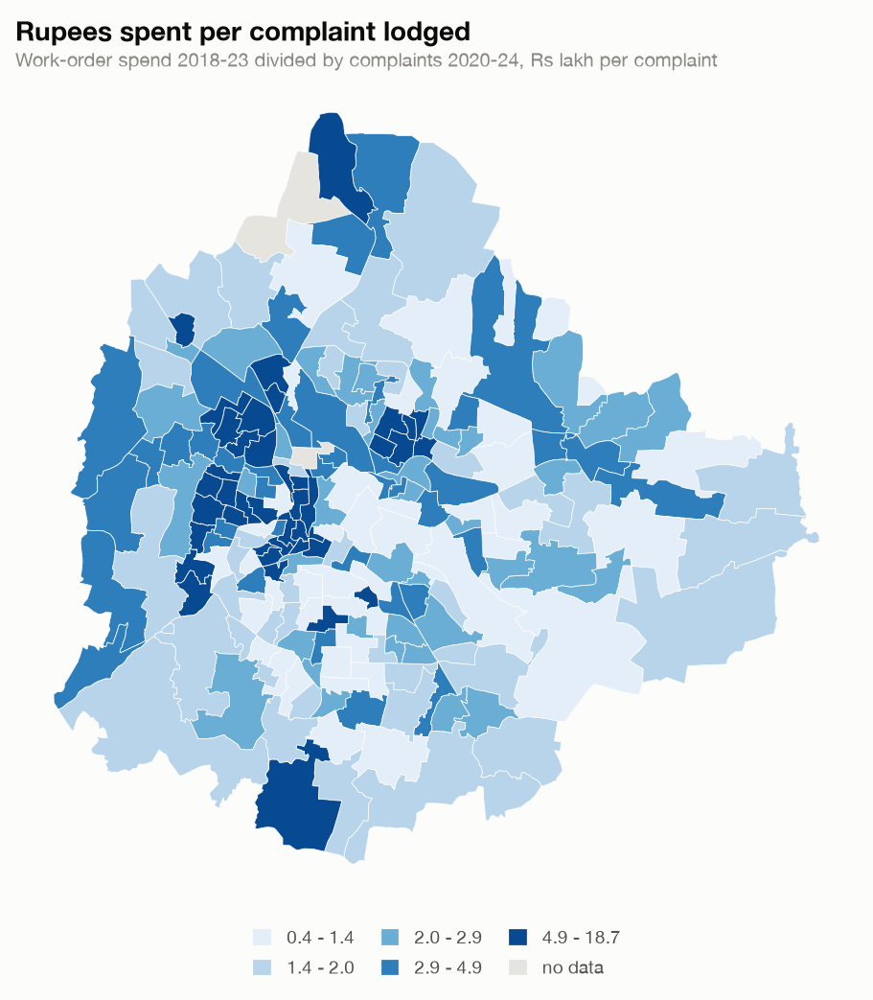

# Do Complaints Follow the Money?

Joining 618,202 Bengaluru citizen complaints to ₹23,241 crore of BBMP work-order
spending, ward by ward.

BBMP publishes both halves of its own accountability loop, what residents
complain about and what it spends money on, as separate datasets on
[OpenCity](https://data.opencity.in). This joins them across all 198 wards and
asks whether the wards that complain most are the wards that get spent on.

---

## Findings

### 1. A third of the money belongs to no ward



Of ₹23,241 crore in gross work orders, **₹8,023 crore, 34.5%, is booked to
`Untagged Expenses/Multiple Wards`** and cannot be traced to any of the 198
wards.

**This is not a new finding.** Citizen Matters reported the same ₹8,023 cr /
₹15,217 cr split in [May 2023](https://citizenmatters.in/opencity-bbmp-spending-by-constituency/).
It is reproduced here independently from the raw files as a check on the
pipeline, and because it frames everything below: for over a third of the money,
the ward-level question cannot be asked at all.

### 2. Complaints and spending point at different problems



Across the three categories that map cleanly onto both datasets:

| Theme | Complaints (2020–24) | Spend (2018–23) | Spearman ρ |
|---|---:|---:|---:|
| Streetlighting | 263,442 | ₹428 cr | +0.24 |
| Waste Management | 152,528 | ₹138 cr | −0.05 |
| Roads and Drains | 91,249 | ₹2,953 cr | +0.42 |

**Roads draw the fewest complaints and 21× the money of waste management.**
Streetlighting is the single largest source of citizen complaints and receives
about a seventh of what roads do. For waste management, the second-largest
complaint category, the ward-level correlation between complaints and spending
is statistically indistinguishable from zero.

The category mapping was checked against the grievance `Sub Category` field
rather than assumed. BBMP's `Electrical` category is **99.1% street and park
lighting**. 95.0% is literally `Street Light Not Working`, with a further 2.1%
requesting new street lights, 1.4% lights left on in daytime and 0.6% park
lights. Only 0.8% (earthing, open junction boxes) sits near BESCOM's domain
rather than BBMP's. `Solid Waste` and `Road Maintenance` break down the same
way: uncollected garbage and potholes, drains and footpaths respectively.

Capital-intensive work is not the same thing as frequently-complained-about
work, and these datasets show the gap plainly. Roads legitimately cost more per
unit than changing a streetlight, so this is not evidence of misallocation on
its own, but it does mean complaint volume is not what drives the budget.

The spending side of this disparity was reported by Citizen Matters in May 2023
(roads and drains ~74% of ward-level funds, waste management 1.1%). What is
added here is the complaint side set against it, per ward.

### 3. More complaints, more money, but only loosely



Pearson r = 0.64, but **Spearman ρ = 0.34**. The gap between the two matters:
the linear correlation is carried by a handful of high-complaint, high-spend
outlier wards, while the *rank* relationship across the bulk of wards is weak.
Knowing a ward's complaint rank tells you comparatively little about its
spending rank.

Ward spending ranges from ₹12 crore (Agaram) to ₹436 crore (Horamavu), a **35×
spread**, against a median of ₹59 crore.

### 4. Spending more does not resolve more complaints



Median complaint-closure rate is essentially flat across all five ward spending
quintiles, from 94.4% to 95.1%, with no trend. The highest-spending wards close
complaints at the same rate as the lowest-spending ones.

Complaint volume itself rose sharply: the median ward saw **2.17× more
complaints in 2024 than in 2020** (91,620 → 207,016 city-wide).

### 5. The geography depends entirely on the denominator (the central finding)



Mapped as raw totals, both spending and complaints look like they concentrate
on Bengaluru's periphery: spending rises with distance from the centre
(ρ = +0.51) and so do complaints (ρ = +0.47).

That is almost entirely a ward-size artifact. BBMP's outer wards are far larger
than its core wards, at a median 4.2 km² in the outer quartile against 0.9 km² in
the inner. Distance from the centre correlates with ward *area* at ρ = +0.60,
more strongly than with either variable of interest.

**Per square kilometre the pattern reverses. Per resident it reverses back.**

| Ring | Median area | Median pop. | Spend / km² | Compl. / km² | Spend / resident | Compl. / 1k |
|---|---:|---:|---:|---:|---:|---:|
| Inner | 1.0 km² | 35,090 | ₹41 cr | 1,363 | ₹12,760 | 44.1 |
| Mid-inner | 1.2 km² | 36,982 | ₹37 cr | 1,659 | ₹11,964 | 50.3 |
| Mid-outer | 1.6 km² | 43,585 | ₹34 cr | 1,535 | ₹16,212 | 51.9 |
| Outer | 6.4 km² | 51,911 | ₹17 cr | 757 | ₹19,181 | 93.3 |

Correlation with distance from the centre (Spearman):

| Measure | Raw | Per km² | Per resident |
|---|---:|---:|---:|
| Complaints | +0.47 | **−0.36** | **+0.32** |
| Spending | +0.51 | **−0.35** | **+0.28** |

Outer wards hold more people *and* far more land, so the two denominators pull
in opposite directions: population density falls outward (ρ = −0.49) while raw
population rises (ρ = +0.59). An outer-ward resident lodges 93.3 complaints per
thousand against the inner ring's 44.1, and has ₹19,181 of work orders behind
them against ₹12,760.

Neither reading is wrong, and the choice is not neutral. A ward-level claim in
this data is only meaningful once it names its denominator, the same trap the
untagged-money and ward-regime problems set in different ways.

### 6. Spend per complaint varies 51× between wards



Dividing each ward's spending by its complaints, both normalised by the same
ward and so boundary-invariant, gives a spread from **₹0.4 lakh per complaint
(Shantala Nagar, Sarakki) to ₹18.7 lakh (Subhash Nagar)**, a 51× range.

High values are concentrated in the western and central-western wards. This is
a ratio of two differently-motivated quantities, not an efficiency score. A
ward with a large capital project and few complaints sits at the same end as a
ward whose complaints go unlogged.

---

## Relation to prior work

Most of the spending side of this analysis is already published, by OpenCity and
by Citizen Matters (both programmes of Oorvani Foundation). This project was
built after checking that work, and is positioned against it deliberately.

**Already published:**

- **[What Rs 23,000 crore of BBMP work orders show](https://citizenmatters.in/opencity-bbmp-spending-by-constituency/)**
  (Vaidya R, Thiyaku S, Ayush Bhosle, Meera K, May 2023). Reports the same
  ₹23,241 cr total, the same ₹8,023 cr untagged / ₹15,217 cr ward-level split,
  and the roads-vs-waste disparity. Aggregates by assembly constituency.
- **[Decoding Bengaluru's Civic Complaints](https://opencity.in/decoding-bengalurus-civic-complaints-a-deep-dive-into-bbmp-grievances-data-2025/)**
  (July 2025). 126,974 grievances across 198 wards for H1 2025: ward choropleth,
  category shares, resolution rates.
- **[BBMP Work Orders, Budgets and Processes Datajam](https://opencity.in/bbmp-work-orders-budgets-and-processes-datajam-july-2023/)**
  (July 2023). One team correlated pothole work orders against Fix My Street
  complaints and found they "did not exactly coincide." One category, one day,
  a different complaint source, no published data or code.
- **[Open letter to the BBMP Commissioner on potholes](https://citizenmatters.in/bbmp-commissioner-potholes-road-accidents-fix-my-street-app/)**
  is the datajam pothole work, formalised. Finds BBMP spent "Rs 4 crore to Rs 25
  crore on pothole management ... but this expenditure was not in the areas that
  citizens complained about," and that 61% of complaints came from roads under
  12 m while repairs went to arterial roads. Spatial and observational; no
  correlation coefficient, no area normalisation, Fix My Street as the source.
- **[Open letter on streetlights and surveillance](https://citizenmatters.in/bbmp-commissioner-streetlights-surveillance-crimes-garbage-prevention-cctvs-road-accidents/)**
  covers streetlight and CCTV work orders against *road accidents*, not complaints.
  No normalisation.
- **[Road Infrastructure Density mapping](https://opencity.in/road-infrastructure-density-mapping-for-bengaluru/)**
  (July 2025). Establishes per-sq-km ward normalisation as an OpenCity method,
  for road length.
- **Citizen Matters ward pages** (e.g. [Ward 27, Banaswadi](https://citizenmatters.in/info-bbmp-ward-27-banaswadi-bangalore/))
  show ward complaints and ward tenders/bills side by side, in parallel
  sections, without comparing them or normalising by the ward area they list.

**What this adds.** The May 2023 article names two limitations of its own:

> "The analysis ... does not correlate spending to citizen complaints or service
> outcomes."

> "[It] can be further expanded by normalising for the area as well as
> population."

This project does both, and adds a correction:

1. **The complaints join, systematically.** 618,202 grievances against ward
   spending, quantified per ward across all three mappable categories, over five
   years, rather than one category, qualitatively, on one day.
2. **Area normalisation of both sides.** Named as future work in 2023 and not
   taken up since. It changes the geographic conclusion (finding 5).
3. **A consequence for the July 2025 grievances analysis.** That piece describes
   complaints as clustering in "peripheral growth areas" and labels its ward map
   complaint *density*, but maps raw counts. Every ward it names as a top
   complaint generator is an outsized peripheral ward. Hemmigepura (28.5 km²,
   the largest in BBMP) ranks 6th by count and **177th of 198 by density**;
   Horamavu ranks 3rd and 149th. Against a median ward of 1.7 km², the rank
   correlation between complaint count and complaint density is **ρ = 0.04**.
   The density leaders are small core wards: Chickpete, Manorayana Palya and
   Sri Nagar, none of which appear in that article's top ten. OpenCity's own
   road-density piece, published 18 days later, uses the correct normalisation.
4. **Resolution rate against spending.** No prior version found.
5. **Ward-level rather than constituency-level**, with the ward-name crosswalk
   published as reusable data and the whole pipeline reproducible from download
   to figure.

## The ward-name crosswalk

The join is only possible because of a reconciliation step that did not
previously exist publicly, published here as
**[`data/out/ward_crosswalk.csv`](data/out/ward_crosswalk.csv)**.

BBMP's grievance extracts carry a ward *name* and no number, spelled differently
from the ward master: `Bellandur`/`Bellanduru`, `Binnipet`/`Binni Pete`,
`Chamrajpet`/`Chamraja Pet`. Only 51% match exactly.

The crosswalk resolves them in three passes:

1. **Exact** match on a normalised key, 136 names
2. **Fuzzy** match, accepted only when the best candidate beats the runner-up by
   a clear margin, so near-identical ward names are never silently guessed
   between, 175 names
3. **Manual**, for names no string metric reaches, 7 names, each verified by
   exact lookup against the ward master: `Hoodi`→Hudi (54), `Ulsoor`→Halsoor
   (90), `Rajamahal`→Raj Mahal Guttahalli (64), `Yadiyuru`→Yediyur (167),
   `Hagadooru`→Hagadur (84), `Gali Anjaneya Swamy Temple`→Gali Anjenaya Temple
   Ward (157), `H.M.T`→HMT Ward (38)

**196 of 198 grievance ward names resolve, with zero collisions.**

## Robustness

Each caveat below was tested rather than left as a caveat. Run
`src/robustness.py` to reproduce.

**The two unmatched ward names** (1.7% of complaints). `Someshwara` most likely
means 198-ward 3 *Atturu*: the 243-ward map's "Someshwara Ward" (also #3) covers
57% of it, and Atturu otherwise records **zero complaints in five years despite
₹350 cr of work orders**, which is implausible unless its complaints are filed under
another name. `Subedarapalya` maps to ward 65 *Kadu Malleshwar* by elimination,
with a volume (1,683) matching its neighbours' median (1,415); this one is
circumstantial. Either way it does not matter:

| | Excluded (published) | Assigned |
|---|---:|---:|
| Wards analysed | 196 | 198 |
| Pearson | 0.639 | 0.648 |
| Spearman | 0.341 | 0.350 |

**The misaligned windows.** Restricting complaints to the years the work-order
data actually covers changes nothing load-bearing:

| Complaint window | Pearson | Spearman | Density vs distance |
|---|---:|---:|---:|
| 2020–24 (published) | 0.639 | 0.341 | −0.362 |
| 2020–23 | 0.645 | 0.357 | −0.343 |
| 2021–23 | 0.641 | 0.344 | −0.352 |

**Census 2011 against a periphery that grew.** This is the weakest of the three.
For the outer ring's complaint rate to fall to the inner ring's, outer wards
would need **2.11× their 2011 population**, or 5.9% compounded annually for 13
years, on top of whatever the core did. Testing directly:

| Outer population assumed | Inner / 1k | Outer / 1k | |
|---|---:|---:|---|
| ×1.25 | 44.1 | 74.6 | outer still higher |
| ×1.5 | 44.1 | 62.2 | outer still higher |
| ×2.0 | 44.1 | 46.7 | outer still higher, barely |

The per-resident gradient survives plausible growth but narrows sharply under
aggressive assumptions. It is the least robust finding here and is stated as
such. The per-km² and raw readings do not depend on population at all.

## Known limitations

- **Two ward names are unresolved.** `Someshwara` (9,262 complaints) and
  `Subedarapalya` (1,683) appear in every grievance year but match no ward in
  BBMP's own 198-ward master. Two master wards (3 Atturu, 65 Kadu Malleshwar)
  correspondingly have no complaints. The counts match, but geography does not
  support pairing them, so they are left unresolved rather than guessed. This
  excludes **1.7% of complaints**; 196 of 198 wards carry both datasets.
- **The time windows do not align.** Complaints cover 2020–24, work orders
  2018–23. Treated as a stock-vs-stock comparison, not a causal one.
- **Correlation is not allocation.** Roads cost more per unit than streetlights.
  These figures show where complaints and money diverge, not that any particular
  ward was shortchanged.
- **Ward regimes.** Both datasets use BBMP's 198-ward regime, verified: the
  grievance files use it in 2020 and 2024 alike. Extending into 2025–26 data
  requires the 198→225→243 delimitation mapping, which is carried in the
  crosswalk's `ward_no_225` column but is not used here.
- **Work-order ward *names* are mangled** in the categorised file
  (`Yelahanka Satellite Town` → `YelahankSatellitTown`). That file is joined on
  its numeric `Ward No` column instead; the names are recorded for reference and
  never used as a key.
- **`Non Relevant` complaints** (BBMP rejections, ~4%) are excluded from the
  denominator; only `Closed` counts as resolved.
- **Gross, not net, work orders** are used throughout. Checked and immaterial:
  deductions run a near-flat 9.1% (p05–p95 of 0.88–0.93 per ward), ward rankings
  are identical (Spearman gross-vs-net = 0.999, same top 20), the untagged share
  is 34.5% gross against 34.4% net, and the headline correlation moves from
  0.639/0.341 to 0.642/0.348.
- **Population is Census 2011**, the only ward-level count published for the
  198-ward regime. Bengaluru's periphery has grown substantially since, so
  per-resident rates in outer wards are, if anything, overstated, and bounded above.
- **The rendered page has not been visually reviewed by its author** beyond the
  static figures; two display bugs (dark-mode ward outlines, local-file encoding)
  were caught by a reader and fixed.

## Reproducing

```bash
python3 -m venv .venv && ./.venv/bin/pip install pandas matplotlib requests scipy geopandas
./.venv/bin/python src/fetch.py            # ~110 MB from OpenCity's CKAN API
./.venv/bin/python src/build_crosswalk.py  # -> data/out/ward_crosswalk.csv
./.venv/bin/python src/build_panel.py      # -> data/out/panel_ward*.csv
./.venv/bin/python src/analyse.py          # -> figures/, prints every number above
./.venv/bin/python src/make_map.py         # -> ward choropleths (needs geopandas)
./.venv/bin/python src/export_web.py       # -> data/out/web_data.json (ward SVG paths + panel)
./.venv/bin/python src/build_web.py        # -> ../docs/<project>/index.html
./.venv/bin/python src/robustness.py       # sensitivity tests, prints the tables above
```

The whole chain is deterministic: from a clean checkout it regenerates
`web/index.html` byte-for-byte identical to the published page.

### The web page

Live at
**[dipan010.github.io/research-city/bbmp-complaints-vs-spending](https://dipan010.github.io/research-city/bbmp-complaints-vs-spending/)**.

The page is a **generated, self-contained file**. All data and geometry are
inlined, so it also opens straight from disk with no server:

```bash
open ../docs/bbmp-complaints-vs-spending/index.html
```

Edit `web/template.html`; the built page is written to the repository's `docs/`
directory, which GitHub Pages serves. The template holds a single
`__DATA__` placeholder that `build_web.py` replaces with the exported payload;
regenerating is what keeps the page's numbers in step with the analysis. The
only network dependency is Google Fonts, which falls back to a system stack
offline.

`src/make_map.py` is kept separate so the rest of the pipeline runs without a
geospatial stack. It uses **BBMP Ward Map - 2015**, the only published BBMP ward
KML with exactly 198 features, matching the ward regime of both datasets. (The
file named *BBMP Ward Map - 2022* contains 243 wards and *BBMP Final Wards Map -
2023* contains 225; neither matches the data used here. The names are
misleading and worth checking before use.) Areas are computed in EPSG:32643.

`src/fetch.py` resolves resource URLs through the CKAN API by dataset title and
resource name rather than hardcoding UUIDs, so it survives re-uploads. It writes
`data/raw/manifest.json` recording the exact URL each file came from, and that
manifest is committed even though the bulk data is not, so any run can be traced
back to its snapshot.

Figures and findings here were generated from data fetched on
**2026-09-05**. OpenCity re-uploads resources periodically, so re-running may
shift counts slightly.

## Sources

All from [data.opencity.in](https://data.opencity.in), published by BBMP:

| Dataset | Used for |
|---|---|
| [BBMP Grievances Data](https://data.opencity.in/dataset/bbmp-grievances-data) | complaints, 2020–24 |
| BBMP Work Orders Categorised (2018-2023) | ward × category spend |
| [BBMP Ward Information](https://data.opencity.in/dataset/bbmp-ward-information) | ward master, delimitation crosswalk, 198-ward boundary KML |

Data is BBMP's, republished by OpenCity (a programme of Oorvani Foundation).
