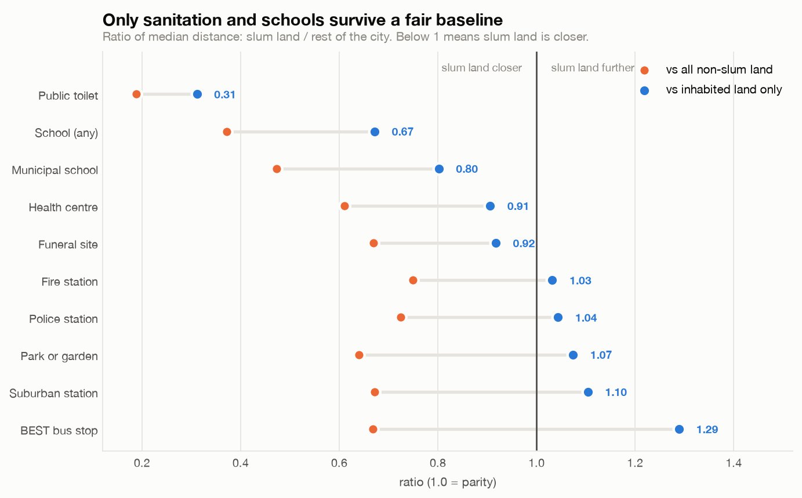
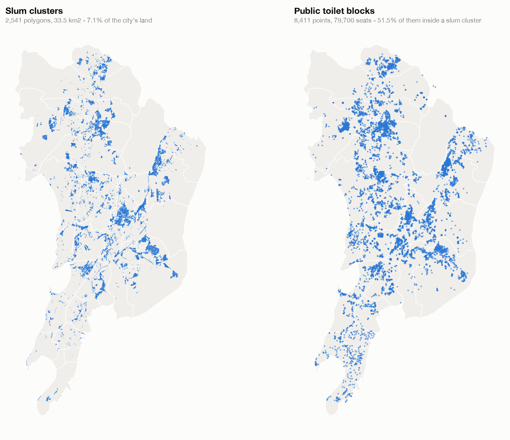
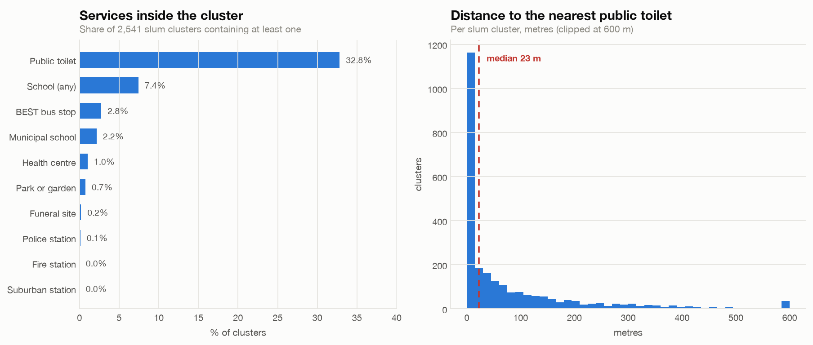
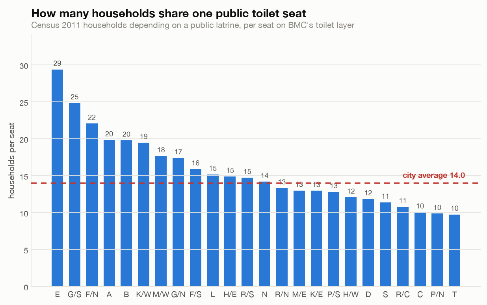
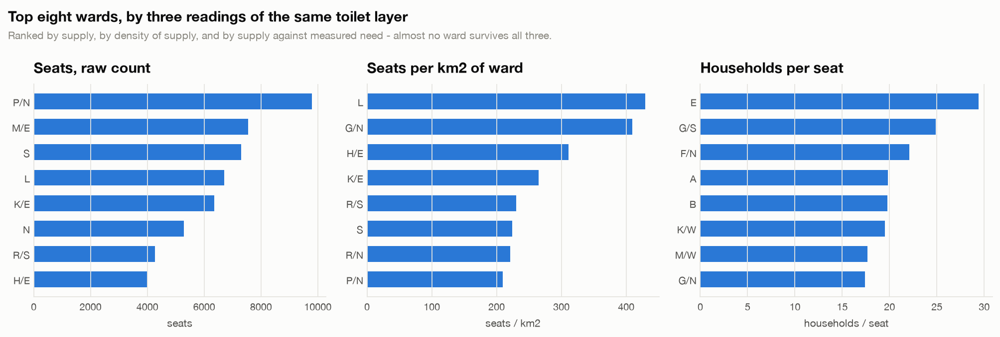
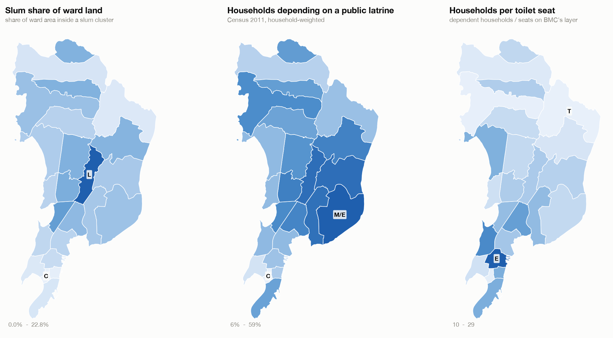
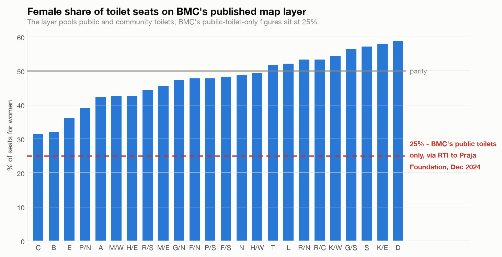

# Mumbai's Toilets Are Where the Slums Are

Overlaying 2,541 slum cluster polygons on ten of BMC's amenity layers, per ward
and per cluster, to ask whether Mumbai's densest and poorest settlements are the
furthest from public services.

They are not, and the shape of the exception is the finding. Against the
inhabited city, Mumbai's slums are **three times closer to a public toilet** and
closer to a school — and **no closer to a park, police station, fire station or
train**. Sanitation provision is aimed; nothing else is. And the sanitation
deficit that undeniably exists is invisible to a distance measure: it is a
question of how many households share each seat, not how far they walk.

**Live: [dipan010.github.io/research-city/mumbai-slums-vs-amenities](https://dipan010.github.io/research-city/mumbai-slums-vs-amenities/)**

---

## Findings

### 1. Aimed at sanitation, not at services in general



A 100 m lattice over Greater Mumbai gives 47,450 cells, 3,344 of them inside a
slum cluster. Measured against *all* non-slum land, slum cells come out closer on
all ten layers — but that baseline is not a fair one. It includes Sanjay Gandhi
National Park, the mangroves, the salt pans and the airport: land with no
services near it and no slums in it.

Restricting the baseline to **inhabited land** — non-slum cells within 300 m of a
BEST stop or 400 m of a school, 25,920 of the 44,106 non-slum cells — most of the
advantage disappears. Each service is scored against a proxy it does not itself
define, so the comparison is never circular.

| Service | Slum | Inhabited city | Ratio | |
|---|---:|---:|---:|---|
| Public toilet | 62 m | 198 m | **0.31** | 3× closer |
| School (any) | 174 m | 259 m | **0.67** | closer |
| Municipal school | 335 m | 418 m | **0.80** | closer |
| Health centre | 503 m | 555 m | 0.91 | parity |
| Funeral site | 697 m | 760 m | 0.92 | parity |
| Fire station | 1,410 m | 1,366 m | 1.03 | parity |
| Police station | 871 m | 835 m | 1.04 | parity |
| Park or garden | 347 m | 323 m | 1.07 | slightly further |
| Suburban station | 1,370 m | 1,240 m | 1.10 | slightly further |
| BEST bus stop | 181 m | 141 m | 1.29 | further |

**The toilet result is the one that does not move.** Across three
independently-defined baselines it ranges only from 0.19 to 0.35, and it is the
sole service never near parity. The within-ward control — where both groups share
the same surrounding geography — agrees:

| Service | Wards where slum land is closer |
|---|---|
| Public toilet | **21 of 21** |
| School (any) | 19 of 21 |
| Municipal school | 19 of 21 |
| Health centre | 17 of 21 |
| BEST bus stop | 14 of 21 |
| Park or garden | 12 of 21 |

This is what a targeted programme looks like in data. BMC builds community
toilets in slums, because that is where households have no latrine of their own.
It has not similarly aimed its parks or its fire stations, and the same
measurement shows that too.

**No p-values are reported here.** Grid cells 100 m apart are heavily spatially
autocorrelated, so a Mann–Whitney test treating them as independent returns
absurd significance (p < 1e-140) that it has not earned. The within-ward counts
above are the evidence instead — they do not assume independence.

### 2. Half the city's toilet seats stand on 7% of its land



Slum clusters cover **33.5 km² — 7.1% of Greater Mumbai**. Inside that footprint
sit **41,021 toilet seats, 51.5% of every seat in the city**.

This is the load-bearing fact of the whole analysis, because it needs no
baseline and no denominator: it is a direct comparison of two published layers.

32.8% of clusters contain a toilet block within their own boundary; the median
cluster is 23 m from one. No other service comes close — 7.4% of clusters contain
a school, 1.0% a health centre, none a fire station.



### 3. The deficit is load, not location



Proximity says nothing about the length of the queue. Census 2011's Houselisting
table HH-14 supplies the missing denominator: the share of households in each
ward with no latrine inside the premises, who depend on a public one.

**40.2% of Greater Mumbai's households — 1,116,508 of them — depended on a public
latrine.** Against 79,700 seats, that is **14.0 households per seat**, or **at
least 63 people per seat** — a lower bound, since it applies a household share to
a population count and latrine-dependent households are, if anything, larger than
average.

Ward E (Byculla, Mazgaon) carries 29.4 households per seat against ward T's 9.8 —
a 3× spread. E is not a ward with much slum land (3.4%); it is an old, dense
chawl-and-tenement ward where a quarter of households still share a public
latrine and only 637 seats serve them.

### 4. The denominator decides the answer



Three readings of one column, and they disagree almost completely:

| Ranked by | Top five wards |
|---|---|
| Seats, raw count | P/N, M/E, S, L, K/E |
| Seats per km² | L, G/N, H/E, K/E, R/S |
| Households per seat | E, G/S, F/N, A, B |



### 5. The toilet layer does not say what it counts, and it matters



Praja Foundation obtained ward-wise toilet figures from BMC under RTI. Their
[May 2025 report](https://data.opencity.in/dataset/report-on-the-status-of-civic-issues-in-mumbai-may-2025)
gives **846 public toilet blocks and 12,517 seats as of December 2024**, about
one seat in four for women — a 6:1 male-to-female ratio in C ward, 4:1 in B, 3:1
in A.

The layer used here holds **8,411 blocks and 79,700 seats at 48.6% female**.
Roughly six times the seats, and twice the female share.

**The two are not counting the same thing.** Praja reports public and community
toilets separately, and their gender profiles are opposite:

| Praja, from BMC RTI | Blocks | Seats | Female share |
|---|---:|---:|---:|
| Public toilets (Dec 2024) | 846 | 12,517 | ~25% |
| Community toilets (Dec 2023) | ~6,676 | not tabulated citywide | near parity — A ward 298M/367F, D ward 318M/232F |
| **This layer** | **8,411** | **79,700** | **48.6%** |

846 + 6,676 ≈ 7,522 blocks against this layer's 8,411, and blending a ~25%-female
public stock with a ~50%-female community stock lands close to the 48.6% observed.
**The layer appears to pool both types.** Nothing on it says so.

That is the finding: *the resource is named "Mumbai Public Toilets" and carries no
scope statement, no vintage and no type field.* Anyone comparing it against BMC's
published public-toilet figures — the natural thing to do, given the name — will
be out by a factor of six on capacity and by half on the gender ratio.

**One ward does not reconcile even so.** C ward has zero community toilets in
Praja's table (it records 0% slum population), so pooling cannot explain anything
there — yet Praja gives C 416 public seats against this layer's 207. Either the
layer is incomplete for C or the ward assignment differs. Left open.

## Relation to prior work

**Praja Foundation, Status of Civic Issues in Mumbai** —
[May 2025](https://data.opencity.in/dataset/report-on-the-status-of-civic-issues-in-mumbai-may-2025),
and the [May 2024](https://www.praja.org/praja_docs/praja_downloads/Key%20Highlights%20of%20Report%20on%20Civic%20Issues%20in%20Mumbai%202024.pdf)
edition before it — is the definitive prior work on Mumbai sanitation and this project
does not displace it. It reports one seat per 752 men and 1,820 women, community
toilet seats adequate for only a third of the slum population, and 69% of blocks
without a water connection — all sourced by RTI, per ward, non-spatial.

It also states plainly:

> "Data on ward wise slum population is not available."

**[Delhi Slums: a comparative look at public facilities](https://opencity.in/delhi-slums-comparative-look-public-facilities/)**
(OpenCity) is the nearest methodological precedent on the platform, for a
different city. A sweep of OpenCity's 181 published articles found no Mumbai
slum-versus-amenity analysis.

**What this adds:**

1. **The spatial join itself** — slum polygons against ten amenity layers, per
   cluster and per 100 m cell. Praja's ward-level RTI tables cannot make this
   measurement and OpenCity has not published it for Mumbai.
2. **A measured denominator where Praja records a gap.** Ward-wise slum
   population is genuinely unpublished. Rather than estimate it, this uses two
   things that *are* measured: slum **area** from the cluster map, and households
   dependent on a public latrine from Census HH-14. Both are stated; neither is
   modelled.
3. **The proximity result with its baseline controls**, which reframes the
   question from siting to capacity — and separates the services BMC has aimed
   at slums from the ones it has not.
4. **That the toilet layer pools public and community toilets without saying so.**
   Visible only by setting the layer against Praja's RTI figures, which separate
   them. It makes the resource straightforwardly misleading to anyone who takes
   its name at face value.

---

## Data vintages

Every figure here is a *stock* comparison across sources of different ages, and
the spread is wide. Stating it plainly, because two of the findings depend on it.

| Source | Vintage | How that is known |
|---|---|---|
| Census population, households, HH-14 latrine access | **2011** | stated by the source |
| Slum cluster polygons | **2015** | named in the resource: "Mumbai - Slum Clusters Map 2015" |
| BMC amenity GIS layers (toilets, schools, health, parks, BEST, funeral, parking) | **undated; most likely ~2023** | no vintage published. The fire-station and police layers in the same export family carry embedded edit timestamps running 2016 to 2023, latest 2023-05-15. The toilet and park layers carry no date fields at all. |
| Suburban rail stations | **2025** | named in the dataset title |
| Praja reference figures — public toilets | **December 2024** | Praja, Status of Civic Issues in Mumbai, May 2025 |
| Praja reference figures — community toilets | **December 2023** | same report |
| Uploaded to OpenCity | 2025-11-25 | CKAN resource dates, all 22 in one batch |
| Fetched for this analysis | 2026-09-06 | `data/raw/manifest.json` |

**What this costs each finding.** The proximity results (finding 1) compare a 2015
slum footprint against ~2023 amenity layers — an eight-year gap, and any cluster
cleared or built since 2015 is misplaced. The load figure (finding 3) divides 2011
households by ~2023 seats: if public-latrine dependence has fallen since 2011, as
it almost certainly has, **14.0 households per seat overstates today's load** and
should be read as an upper bound on a 2011 population, not a current measurement.
Finding 2 — 51.5% of seats on 7.1% of land — compares the 2015 slum map against
the ~2023 toilet layer and is the least vintage-sensitive, since both are
geographies rather than counts.

Praja's most recent Mumbai report is *Status of Civic Services, Environmental &
Climate Issues in Mumbai 2026* (30 June 2026), but it shifts focus to environment
and climate and does not appear to update the toilet tables — established from
press coverage of the launch, not the report PDF, so treat that as unconfirmed.

## Method

**Wards are assigned by spatial join, never by the ward field the layers carry** —
geometry is what is being analysed. The two were compared anyway, and the
disagreement is itself a data-quality finding:

| Layer | Labelled points | Attribute disagrees with geometry | Per-ward count ρ |
|---|---:|---:|---:|
| Public toilets | 8,398 | 3.1% | 0.995 |
| Health UPHCs | 209 | 13.9% | 0.813 |
| Parks | 950 | 2.7% | 0.994 |
| Funeral sites | 205 | 4.4% | 0.979 |

Ward counts rank almost identically either way, so the tables here do not depend
on the choice; individual points do.

**Ward labels are normalised by exact lookup, never inferred.** The layers spell
the same 24 wards inconsistently — the toilet layer says `KE`, the ward map says
`K/E`. `norm_ward()` strips separators and looks the result up against BMC's
canonical 24; anything that does not land on a real ward returns `None` rather
than being guessed at.

**Three census products are reconciled by code, not by name.** `census_wards.csv`
supplies the census-ward → BMC-ward label and population; the Primary Census
Abstracts supply households; HH-14 supplies latrine access. The two independent
population counts reconcile to **exactly 12,442,373**, which is the check that
the join is right.

**HH-14 reports percentages, not counts**, so aggregating 97 census wards up to 24
BMC wards is a household-weighted mean — a plain average would let a
4,000-household ward pull as hard as a 60,000-household one.

### On the statistics

Mumbai has 24 wards. At that n, a Spearman coefficient needs about 0.41 to clear
the 5% level, so **no ward-level correlation is reported here as a finding**. The
inference lives at cluster level (n = 2,541) and grid-cell level (n = 47,450);
the ward tables describe 24 named units and nothing more. This is the one place
the sibling BBMP project's structure could not be copied — 196 wards supports a
coefficient, 24 does not.

## Robustness

Each caveat below was tested rather than left as a caveat. Run
`src/robustness.py` to reproduce.

**Polygon distance vs the centroid shortcut.** Measuring from a cluster's centroid
rather than its boundary would have inflated every access figure, most for exactly
the largest settlements:

| | Median | p90 | Share at 0 m |
|---|---:|---:|---:|
| Polygon (published) | 23 m | 254 m | 32.8% |
| Centroid | 72 m | 309 m | 0.0% |

Centroid overstates by a median 33 m overall, 54 m for the largest decile.

**The unpaired census ward code.** Census ward 1045 (H/E) carries no HH-14 row;
HH-14 carries a code 3837 that appears in no other census product. A clean
one-for-one mismatch, left unpaired rather than guessed. Pairing them moves the
city-wide figure by 0.04 pp and H/E's by 3.6 pp, and changes no reported ranking.
H/E's latrine figure covers 68.2% of its households, which is recorded per ward.

**Toilets with no seat count.** 36 of 8,411 points (0.4%). Treated as zero;
giving them the median 8 seats leaves households-per-seat at 14.0. **The deficit
is a lower bound either way** — blanks can only understate supply.

**What counts as inhabited land** — the judgement call finding 1 rests on. Three
independently-defined baselines, each scoring only services it does not itself
define:

| Service | All land | ≤300 m of a BEST stop | ≤400 m of a school | Published |
|---|---:|---:|---:|---:|
| Public toilet | 0.19 | 0.32 | 0.35 | **0.31** |
| School (any) | 0.37 | 0.67 | — | **0.67** |
| Municipal school | 0.47 | 0.80 | 0.99 | **0.80** |
| Health centre | 0.61 | 0.91 | 0.98 | **0.91** |
| Funeral site | 0.67 | 0.92 | 1.01 | **0.92** |
| Fire station | 0.75 | 1.06 | 1.09 | **1.03** |
| Police station | 0.72 | 1.07 | 1.09 | **1.04** |
| Park or garden | 0.64 | 1.12 | 1.18 | **1.07** |
| Suburban station | 0.67 | 1.14 | 1.26 | **1.10** |
| BEST bus stop | 0.67 | — | 1.29 | **1.29** |

Only the toilet row is stable and never near parity. Schools survive; health and
funeral sites fall to parity; parks, police, fire, rail and bus reverse. Reporting
the unrestricted column alone would have overstated the case for nine of ten
services.

**Undeveloped land, by ward.** Excluding the four least-dense wards moves the
unrestricted city-wide toilet ratio from 0.19 to 0.21. The within-ward control is
stronger still.

**Grid spacing.** Subsampling the lattice 1-in-4 and 1-in-16 moves the toilet
ratio from 0.19 to 0.19 to 0.22.

**Overlapping slum polygons.** 0.56% of summed area is double-counted (33.455 km²
summed vs 33.269 km² union). The grid uses the union, so the slum/non-slum split
is overlap-free.

## Known limitations

- **Layer vintages span 2011 to 2025** and are set out in full in the Data
  vintages section above, with what each costs each finding. In short: the load
  figure divides 2011 households by ~2023 seats and is an upper bound on today's
  load, not a current measurement; the proximity results compare a 2015 slum
  footprint against ~2023 amenity layers. CKAN's own dates are the 2025-11-25
  bulk-upload date for all 22 resources and carry no vintage information.
- **No ward-wise slum population exists**, as Praja also records. Slum area and
  census latrine dependence are used instead. Neither is a population.
- **The "inhabited land" baseline is a proxy, not a measurement.** No built-up
  land layer is published for Mumbai, so bus-stop and school density stand in for
  it. Three variants are tested and agree on which results survive, but a true
  built-up layer could shift the parity cases either way. The toilet result is
  robust to all three; the near-parity rows should be read as "no clear
  difference", not as precise ratios.
- **Distance is straight-line**, not walking distance. It understates real travel
  everywhere and most in dense lanes, so ranking rather than level is what should
  be read from it.
- **16 police placemarks and 1 slum placemark carry no geometry** and are excluded;
  counted and reported rather than silently dropped. 13 toilet points fall outside
  every ward polygon (121 seats).
- **The BEST, rail and school layers carry almost no ward labels**, so the
  attribute-vs-geometry check is only meaningful for the four layers tabled above.
- **The toilet layer's scope is inferred, not stated.** That it pools public and
  community toilets is the best explanation for the six-fold seat gap and the
  gender profile, and the arithmetic supports it — but BMC publishes no scope
  field, so this is inference from Praja's separately-tabulated figures rather
  than something the layer confirms. C ward does not reconcile under it.
- **`Count_of_M` / `Count_of_F` are taken at face value.** Whether they count
  seats, or something else, is not documented on the layer — finding 5 is partly
  about exactly that ambiguity.
- **The rendered page has not been visually reviewed in a browser** — the browser
  extension was unavailable during the build. It was validated structurally
  (every referenced element ID resolves, the JS parses, charset present, no
  placeholder left) but not looked at.

## Reproducing

```bash
python3 -m venv .venv && ./.venv/bin/pip install pandas matplotlib requests scipy geopandas openpyxl
./.venv/bin/python src/fetch.py         # ~23 MB from OpenCity's CKAN API
./.venv/bin/python src/build_wards.py   # -> data/out/ward_census.csv
./.venv/bin/python src/build_access.py  # -> cluster_access, ward_amenities (+ interim grid)
./.venv/bin/python src/analyse.py       # -> figures/, prints every number above
./.venv/bin/python src/make_map.py      # -> maps and ward choropleths
./.venv/bin/python src/export_web.py    # -> data/out/web_data.json
./.venv/bin/python src/build_web.py     # -> ../docs/<project>/index.html
./.venv/bin/python src/robustness.py    # sensitivity tests, prints the tables above
```

### Data published here

| File | What it is |
|---|---|
| [`data/out/cluster_access.csv`](data/out/cluster_access.csv) | **2,541 slum clusters**, each with its ward, area, distance to the nearest facility of ten types, how many fall inside it, and the toilet seats it contains. The reusable artifact of this project — no per-cluster amenity-access table for Mumbai's slums existed publicly. |
| [`data/out/ward_amenities.csv`](data/out/ward_amenities.csv) | the 24-ward panel: population, households, slum area, amenity counts, toilet seats by sex, and Census HH-14 latrine dependence |
| [`data/out/ward_census.csv`](data/out/ward_census.csv) | Census 2011 ward denominators, with the household-weighted HH-14 percentages and per-ward coverage |
| [`data/out/layer_report.csv`](data/out/layer_report.csv) | per-layer point counts and placemarks carrying no geometry |

The 100 m grid (47,450 cells, 9 MB) is written to `data/interim/` rather than
`data/out/` — it is an input to the analysis, fully regenerable, and too large to
be worth committing.

`src/mumbai.py` holds the shared loaders — KML parsing, ward-label
normalisation, projections. It exists because the two traps it defuses are silent
when got wrong: placemarks that carry no geometry, and ward labels spelled four
different ways. Both are counted and reported rather than dropped.

`src/fetch.py` resolves resource URLs through the CKAN API by dataset title and
resource name rather than hardcoding UUIDs, so it survives re-uploads, and writes
`data/raw/manifest.json` recording the exact URL and CKAN dates for every file.
That manifest is committed even though the bulk data is not.

Distances are computed in **EPSG:32643** (UTM 43N), which covers Mumbai's 72.8°E —
checked, not assumed.

### The web page

The page is a generated, self-contained file — all data and geometry inlined, so
it opens straight from disk with no server:

```bash
open ../docs/mumbai-slums-vs-amenities/index.html
```

Edit `web/template.html`; the built page goes to the repository's `docs/`
directory, which GitHub Pages serves. The template holds a single `__DATA__`
placeholder that `build_web.py` replaces. It reuses the sibling BBMP project's
design tokens so the two read as one series.

## Sources

All from [data.opencity.in](https://data.opencity.in). 22 resources; see
`data/raw/manifest.json` for exact URLs and dates.

| Dataset | Used for |
|---|---|
| [Mumbai - Slum Cluster Map](https://data.opencity.in/dataset/mumbai-slum-cluster-map) | 2,541 cluster polygons |
| [Mumbai Wards Map](https://data.opencity.in/dataset/mumbai-wards-map) | 24 ward boundaries |
| [Mumbai Public Toilets](https://data.opencity.in/dataset/mumbai-public-toilets) | 8,411 blocks with M/F seat counts |
| Mumbai City Public Health Centres | dispensaries, UPHCs, hospitals, maternity homes |
| Mumbai Schools Locations | municipal, aided and unaided schools |
| Mumbai - Public Gardens, Parks and Zoos · Fire Stations · Police Station Locations · BEST Bus Stops and Depots · Funeral and Cremation Sites · Parking · Suburban Network 2025 | amenity layers |
| [Mumbai - Ward wise Census Data](https://data.opencity.in/dataset/mumbai-ward-wise-census-data) | population, households, and HH-14 latrine access |

Data is BMC's and the Census of India's, republished by OpenCity (a programme of
Oorvani Foundation).

Public-toilet access in slum settlements is a real-stakes subject. Rates here are
reported against measured denominators, layer vintages are stated, and no causal
claim is made about any ward.
